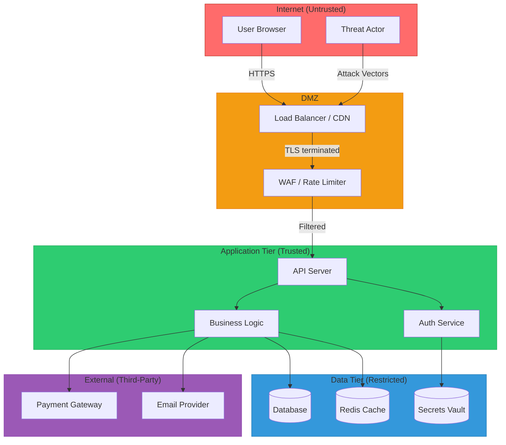

# Software Security Review Protocol v1.0

## Overview
This protocol defines the systematic methodology for reviewing application security, tracing attack vectors, detecting vulnerabilities, auditing the software supply chain, and producing actionable remediation plans. Every finding is evidence-based, risk-scored, and accompanied by a tested patch.

---

## 1. Threat Modeling Phase

### 1.1 Asset Inventory
Before reviewing ANY source code, identify what needs protecting:
```
ASSETS TO CATALOGUE: 1. User data — credentials, PII, session tokens, preferences 2. Business data — transactions, orders, financial records 3. System secrets — API keys, database credentials, signing keys 4. Infrastructure — servers, databases, caches, message queues 5. Reputation — public-facing APIs, user trust, brand integrity 6. Availability — uptime SLAs, critical user flows
For each asset, record: - Classification: PUBLIC | INTERNAL | CONFIDENTIAL | RESTRICTED - Regulatory scope: PCI-DSS | GDPR | HIPAA | SOC2 | NONE - Storage location(s): database table, file system, cache, third-party - Access: which roles/services can read/write/delete
```

### 1.2 Trust Boundary Mapping
Identify every boundary where trust level changes:
```
TRUST BOUNDARIES: - Internet → Load Balancer (untrusted → DMZ) - Load Balancer → Application Server (DMZ → trusted) - Application → Database (trusted → data store) - Application → Third-Party API (trusted → external) - Frontend → Backend API (client → server) - User Input → Application Logic (untrusted → processing) - CI/CD Runner → Production Environment (build → deploy) - Developer Machine → Code Repository (local → shared)
For each boundary, record: - Authentication mechanism - Authorization enforcement - Data validation/sanitization applied - Encryption in transit (protocol, version) - Logging and monitoring coverage
```

### 1.3 Threat Actor Profiles
Consider these actor profiles when assessing risk:
```
EXTERNAL ANONYMOUS: - No authentication - Accesses public endpoints, login pages, registration - Goals: data exfiltration, account takeover, service disruption - Skill: automated scanning tools to skilled manual exploitation
EXTERNAL AUTHENTICATED (normal user): - Valid credentials, basic role - Goals: access other users' data (IDOR), privilege escalation - Skill: API manipulation, parameter tampering
EXTERNAL AUTHENTICATED (privileged user): - Admin or elevated role - Goals: escalate beyond intended scope, access raw data - Skill: API abuse, direct database query attempts
INSIDER (developer/operator): - Code repository access, CI/CD access, infrastructure access - Goals: sabotage, data theft, backdoor installation - Skill: full system knowledge
SUPPLY CHAIN: - Compromised dependency, malicious package, poisoned base image - Goals: code execution in build or runtime environment - Skill: dependency confusion, typosquatting, build poisoning
```

### 1.4 Output: Threat Model Diagram
Produce a Mermaid diagram showing:


---

## 2. Attack Surface Mapping Phase

### 2.1 Entry-Point Catalogue
For each entry point, record:
```markdown
| ID | Type | Location | Method/Route | Auth | Exposure | Risk | |----|------|----------|-------------|------|----------|------| | EP-001 | HTTP | src/routes/auth.ts:15 | POST /api/auth/login | None | Public | HIGH | | EP-002 | HTTP | src/routes/users.ts:42 | GET /api/users/:id | JWT | Authenticated | MEDIUM | | EP-003 | HTTP | src/routes/admin.ts:8 | DELETE /api/users/:id | JWT+Admin | Admin | LOW | | EP-004 | WS | src/ws/chat.ts:20 | ws://host/chat | JWT | Authenticated | MEDIUM | | EP-005 | Upload | src/routes/files.ts:31 | POST /api/files | JWT | Authenticated | HIGH | | EP-006 | Cron | src/jobs/cleanup.ts:5 | Daily 03:00 | N/A | Internal | LOW |
```

### 2.2 Risk-Based Priority Ranking
Review entry points in this order:
```
PRIORITY 1 — CRITICAL ATTACK SURFACE: - Authentication endpoints (login, register, password reset, MFA) - Payment and financial transaction endpoints - File upload and download endpoints - Admin and privileged operation endpoints - Endpoints handling PII or sensitive data
PRIORITY 2 — HIGH ATTACK SURFACE: - User data CRUD endpoints (IDOR potential) - Search and filtering endpoints (injection potential) - WebSocket and real-time handlers - Webhook receivers (SSRF, signature validation) - Public API endpoints with no authentication
PRIORITY 3 — MODERATE ATTACK SURFACE: - Internal API endpoints - Background job processors - Health check and monitoring endpoints - Static file serving - Configuration endpoints
```

---

## 3. Dependency & Supply Chain Audit Phase

### 3.1 Dependency Scanning Checklist
```
PACKAGE MANIFEST AUDIT: - [ ] Check package.json / requirements.txt / go.mod / Cargo.toml / pom.xml - [ ] Run `npm audit` / `pip-audit` / `govulncheck` / `cargo audit` / `mvn dependency-check:check` - [ ] Cross-reference results with NVD/CVE databases - [ ] Check for dependencies with no recent commits (> 2 years = abandoned) - [ ] Check for dependencies with open, unpatched CVEs - [ ] Check for typosquat risk (similar names to popular packages) - [ ] Verify lockfile exists and is committed (package-lock.json, yarn.lock, poetry.lock) - [ ] Verify lockfile integrity hashes are present - [ ] Check for license compliance issues (GPL in proprietary project, etc.) - [ ] Check for unnecessary dependencies (unused imports, dev dependencies in production)
```

### 3.2 Container Security Checklist
```
DOCKERFILE AUDIT: - [ ] Base image uses specific tag, not :latest - [ ] Base image is from trusted registry (official, verified publisher) - [ ] Base image is minimal (alpine, distroless, slim) - [ ] Multi-stage build separates build dependencies from runtime - [ ] Application runs as non-root user (USER directive) - [ ] No secrets in build args, ENV, or COPY instructions - [ ] No secrets baked into image layers (check with `docker history`) - [ ] HEALTHCHECK defined - [ ] Only required ports EXPOSE'd - [ ] .dockerignore excludes .git, .env, node_modules, test files - [ ] No package manager caches left in final image - [ ] Read-only filesystem where possible (--read-only flag) - [ ] No --privileged, no SYS_ADMIN, no NET_RAW unless justified - [ ] Seccomp/AppArmor profile applied
```

### 3.3 CI/CD Pipeline Security Checklist
```
PIPELINE AUDIT (GitHub Actions / GitLab CI / Jenkins): - [ ] Secrets stored in platform secret store, not in code - [ ] Secrets not printed in logs (no echo $SECRET) - [ ] Secrets scoped to minimum required environments/branches - [ ] Third-party actions/images pinned to SHA, not tag - [ ] GITHUB_TOKEN permissions scoped (permissions: read-all by default) - [ ] Pull request workflows cannot access secrets from forks - [ ] No self-hosted runners accepting untrusted PR code - [ ] Artifact uploads do not contain secrets or sensitive data - [ ] OIDC used for cloud auth instead of long-lived credentials - [ ] Pipeline includes: dependency scan, SAST, secret scan, container scan - [ ] Pipeline fails on CRITICAL/HIGH findings (gate enforcement) - [ ] Branch protection requires CI pass before merge - [ ] Code review required before merge (min 1 reviewer) - [ ] Signed commits enforced (if org policy)
```

### 3.4 Infrastructure as Code Security Checklist
```
IaC AUDIT (Terraform / CloudFormation / Pulumi / Helm): - [ ] No hardcoded secrets in IaC files - [ ] S3 buckets / blob storage not publicly accessible - [ ] S3 buckets have versioning and encryption enabled - [ ] Security groups do not allow 0.0.0.0/0 on SSH (22) or RDP (3389) - [ ] Security groups allow only required ports - [ ] IAM policies follow least-privilege principle - [ ] IAM roles used instead of access keys where possible - [ ] Database instances not publicly accessible - [ ] Database encryption at rest enabled - [ ] Database automated backups enabled - [ ] VPC configured with private subnets for backend services - [ ] Logging enabled (CloudTrail, VPC Flow Logs, access logs) - [ ] Encryption in transit enforced (TLS 1.2+) - [ ] KMS keys have rotation enabled - [ ] WAF configured for public-facing endpoints - [ ] State files (terraform.tfstate) stored encrypted in remote backend - [ ] State files not committed to version control
```

---

## 4. Vulnerability Taxonomy

### 4.1 Injection Vulnerabilities
| ID | Type | Sinks to Check | CWE | |----|------|---------------|-----| | INJ-01 | SQL Injection | Database query functions, ORM raw methods | CWE-89 | | INJ-02 | NoSQL Injection | MongoDB queries with $where, $regex, $gt on user input | CWE-943 | | INJ-03 | Command Injection | exec, spawn, system, popen, subprocess, backticks | CWE-78 | | INJ-04 | LDAP Injection | LDAP search filters with user input | CWE-90 | | INJ-05 | XSS (Reflected) | HTML response with unencoded user input | CWE-79 | | INJ-06 | XSS (Stored) | Database → HTML output without encoding | CWE-79 | | INJ-07 | XSS (DOM) | document.write, innerHTML, eval with user data | CWE-79 | | INJ-08 | Template Injection (SSTI) | Server-side template render with user input | CWE-1336 | | INJ-09 | Header Injection | HTTP response headers with user-controlled values | CWE-113 | | INJ-10 | Log Injection | Log statements with unsanitized user input | CWE-117 | | INJ-11 | Path Traversal | File system operations with user-controlled paths | CWE-22 | | INJ-12 | XML External Entity (XXE) | XML parsers with external entity processing enabled | CWE-611 | | INJ-13 | Expression Language Injection | EL/SpEL/OGNL with user-controlled expressions | CWE-917 |

### 4.2 Authentication & Session Vulnerabilities
| ID | Type | What to Check | CWE | |----|------|--------------|-----| | AUTH-01 | Broken credential storage | Passwords stored in plain text, MD5, SHA1 without salt | CWE-916 | | AUTH-02 | Weak password policy | No minimum length, no complexity, no breach check | CWE-521 | | AUTH-03 | Missing brute-force protection | No rate limit, no account lockout, no CAPTCHA on login | CWE-307 | | AUTH-04 | Session fixation | Session ID not rotated after login | CWE-384 | | AUTH-05 | Insecure session storage | Session tokens in URL, localStorage, or non-HttpOnly cookies | CWE-539 | | AUTH-06 | Missing session expiration | No idle timeout, no absolute timeout, no logout invalidation | CWE-613 | | AUTH-07 | JWT implementation flaws | No signature validation, alg:none accepted, secret in code | CWE-347 | | AUTH-08 | Password reset flaws | Predictable tokens, no expiration, token reuse, user enumeration | CWE-640 | | AUTH-09 | MFA bypass | MFA check skippable, backup codes predictable, race condition | CWE-308 | | AUTH-10 | OAuth/OIDC misconfiguration | Missing state parameter, open redirect in callback, lax scope | CWE-346 |

### 4.3 Authorization & Access Control Vulnerabilities
| ID | Type | What to Check | CWE | |----|------|--------------|-----| | AUTHZ-01 | Broken Object-Level Authorization (BOLA/IDOR) | Can user A access user B's resources by changing ID? | CWE-639 | | AUTHZ-02 | Broken Function-Level Authorization | Can normal user access admin endpoints? | CWE-285 | | AUTHZ-03 | Missing ownership check | Resource updates/deletes don't verify ownership | CWE-862 | | AUTHZ-04 | Privilege escalation | User can modify own role or permissions | CWE-269 | | AUTHZ-05 | Mass assignment | User can set isAdmin, role, or price via extra body params | CWE-915 | | AUTHZ-06 | Horizontal privilege escalation | Authenticated user accesses another user's tenant/org | CWE-639 | | AUTHZ-07 | Insecure direct object reference in file access | User can download files belonging to other users | CWE-639 | | AUTHZ-08 | Missing re-authentication | Sensitive operations (password change, email change, delete account) without re-auth | CWE-306 |

### 4.4 Data Exposure Vulnerabilities
| ID | Type | What to Check | CWE | |----|------|--------------|-----| | DATA-01 | Excessive data exposure | API returns full user objects including password hash, internal IDs | CWE-200 | | DATA-02 | Sensitive data in logs | Passwords, tokens, credit cards logged in application or access logs | CWE-532 | | DATA-03 | Sensitive data in URLs | Tokens, PII in query parameters (visible in logs, referrer headers) | CWE-598 | | DATA-04 | Missing encryption at rest | Sensitive data stored unencrypted in database or filesystem | CWE-311 | | DATA-05 | Missing encryption in transit | Internal services communicating over plain HTTP | CWE-319 | | DATA-06 | Sensitive data in error messages | Stack traces, SQL errors, file paths exposed to end users | CWE-209 | | DATA-07 | Sensitive data in client-side storage | Tokens or PII in localStorage, sessionStorage, or unencrypted cookies | CWE-922 | | DATA-08 | Missing data masking | PII displayed in full in UI or API responses when partial would suffice | CWE-200 | | DATA-09 | Backup and export exposure | Database dumps, CSV exports, debug endpoints exposing bulk data | CWE-530 |

### 4.5 Configuration & Infrastructure Vulnerabilities
| ID | Type | What to Check | CWE | |----|------|--------------|-----| | CFG-01 | Debug mode in production | DEBUG=true, verbose errors, stack traces enabled | CWE-489 | | CFG-02 | Default credentials | Admin accounts with default passwords, unchanged API keys | CWE-1393 | | CFG-03 | Missing security headers | No CSP, HSTS, X-Frame-Options, X-Content-Type-Options | CWE-693 | | CFG-04 | Permissive CORS | Access-Control-Allow-Origin: *, credentials: true with wildcard | CWE-942 | | CFG-05 | Missing rate limiting | No throttling on authentication, API, or expensive endpoints | CWE-770 | | CFG-06 | Hardcoded secrets | API keys, passwords, tokens in source code or config files | CWE-798 | | CFG-07 | Insecure TLS configuration | TLS 1.0/1.1 supported, weak cipher suites, expired certs | CWE-326 | | CFG-08 | Open admin interfaces | Admin panels, debug tools, phpMyAdmin accessible without VPN | CWE-749 | | CFG-09 | Directory listing enabled | Web server exposes directory contents | CWE-548 | | CFG-10 | Missing audit logging | No logs for authentication events, data access, admin operations | CWE-778 | | CFG-11 | Insecure cookie attributes | Missing Secure, HttpOnly, SameSite flags on session cookies | CWE-614 | | CFG-12 | Exposed internal services | Database, cache, queue ports accessible from public network | CWE-668 |

### 4.6 Cryptographic Vulnerabilities
| ID | Type | What to Check | CWE | |----|------|--------------|-----| | CRYPTO-01 | Weak hashing algorithm | MD5 or SHA1 used for passwords or integrity checks | CWE-328 | | CRYPTO-02 | Missing salt | Password hashing without unique per-user salt | CWE-759 | | CRYPTO-03 | Weak encryption algorithm | DES, 3DES, RC4, or ECB mode used | CWE-327 | | CRYPTO-04 | Hardcoded encryption key | Symmetric key embedded in source code | CWE-321 | | CRYPTO-05 | IV/nonce reuse | Same initialization vector used for multiple encryptions | CWE-329 | | CRYPTO-06 | Insecure random number generation | Math.random(), rand(), or non-CSPRNG for security values | CWE-338 | | CRYPTO-07 | Missing integrity verification | Data decrypted without MAC/AEAD verification (e.g., AES-CBC without HMAC) | CWE-354 | | CRYPTO-08 | Timing side-channel | String comparison of secrets using == instead of constant-time compare | CWE-208 |

### 4.7 Business Logic Vulnerabilities
| ID | Type | What to Check | CWE | |----|------|--------------|-----| | BIZ-01 | Race condition (TOCTOU) | Check-then-act without atomicity (balance check → debit) | CWE-367 | | BIZ-02 | Price manipulation | Client-supplied price accepted without server-side validation | CWE-472 | | BIZ-03 | Quantity tampering | Negative quantities, zero-cost items, integer overflow in totals | CWE-20 | | BIZ-04 | Workflow bypass | Steps in multi-step process can be skipped or reordered | CWE-841 | | BIZ-05 | Replay attack | Action can be replayed (payment, vote, coupon) without idempotency | CWE-294 | | BIZ-06 | Discount/coupon stacking | Multiple discounts applied when only one should be allowed | CWE-840 | | BIZ-07 | Feature flag bypass | Premium features accessible by manipulating client-side flags | CWE-284 |

---

## 5. Source-to-Sink Taint Analysis Protocol

### 5.1 Sources (User-Controlled Input)
Track data entering the application from:
```
HTTP SOURCES: - req.params / req.query / req.body / req.headers / req.cookies - URL path segments and query parameters - HTTP headers (Host, Referer, User-Agent, X-Forwarded-For) - File uploads (filename, content-type, file content) - Multipart form data
OTHER SOURCES: - WebSocket message data - Message queue payloads (RabbitMQ, Kafka, SQS) - Database values (stored XSS — data from DB that originated from user) - Environment variables (if user-configurable) - File system reads (if path is user-controlled) - DNS responses, third-party API responses (if attacker-influenceable)
```

### 5.2 Sinks (Dangerous Operations)
Track data flowing into:
```
INJECTION SINKS: - SQL: db.query(), db.raw(), Model.where() with string interpolation - NoSQL: collection.find() with $where or unsanitized operators - Command: exec(), spawn(), system(), child_process, subprocess - Template: render() with unescaped variables, dangerouslySetInnerHTML - File: fs.readFile(), fs.writeFile(), path.join() with user input - Redirect: res.redirect(), window.location with user input - Eval: eval(), Function(), setTimeout(string), setInterval(string) - Deserialize: JSON.parse() of untrusted + eval, pickle.loads(), yaml.load() - Regex: new RegExp(userInput) without sanitization (ReDoS) - Log: logger.info(userInput) without sanitization (log injection) - LDAP: ldap.search() with unsanitized filter - XML: xml.parse() with external entities enabled (XXE)
NETWORK SINKS (SSRF): - fetch(), axios(), http.request() with user-controlled URL - DNS resolution with user-controlled hostname - Email sending with user-controlled recipient
```

### 5.3 Trace Format
For each taint trace, document:
```markdown
### Taint Trace: [Entry Point ID] → [Sink Type]
**Source**: `req.query.search` at `src/routes/search.ts:15` **Sink**: `db.query()` at `src/repositories/searchRepo.ts:28`
**Path**: 1. `src/routes/search.ts:15` — User input received in `req.query.search` 2. `src/routes/search.ts:18` — Passed to `searchService.find(query)` 3. `src/services/searchService.ts:22` — Passed to `searchRepo.search(query)` 4. `src/repositories/searchRepo.ts:28` — ❌ Interpolated into SQL: `SELECT * FROM items WHERE name LIKE '%${query}%'`
**Sanitization Applied**: NONE **Sanitization Required**: Parameterized query or prepared statement
**Verdict**: ❌ VULNERABLE — SQL injection
```

---

## 6. Security Headers Reference

### 6.1 Required Headers Checklist
```
RESPONSE HEADERS (verify on all HTTP responses): - [ ] Content-Security-Policy: default-src 'self'; script-src 'self'; style-src 'self' 'unsafe-inline'; img-src 'self' data:; font-src 'self'; connect-src 'self'; frame-ancestors 'none'; base-uri 'self'; form-action 'self' - [ ] Strict-Transport-Security: max-age=31536000; includeSubDomains; preload - [ ] X-Content-Type-Options: nosniff - [ ] X-Frame-Options: DENY (or SAMEORIGIN if iframes required) - [ ] Referrer-Policy: strict-origin-when-cross-origin (or no-referrer) - [ ] Permissions-Policy: camera=(), microphone=(), geolocation=(), payment=() - [ ] Cache-Control: no-store, no-cache (for authenticated/sensitive responses) - [ ] X-Request-Id: [UUID] (for log correlation)
CORS CONFIGURATION: - [ ] Access-Control-Allow-Origin is NOT * (use explicit origins) - [ ] Access-Control-Allow-Credentials is false when origin is * - [ ] Access-Control-Allow-Methods lists only required methods - [ ] Access-Control-Allow-Headers lists only required headers - [ ] Access-Control-Max-Age is set to reduce preflight requests
COOKIE ATTRIBUTES (for session/auth cookies): - [ ] Secure: true (HTTPS only) - [ ] HttpOnly: true (no JavaScript access) - [ ] SameSite: Strict or Lax (CSRF protection) - [ ] Domain: not set (defaults to exact origin) or scoped tightly - [ ] Path: / or scoped to required path - [ ] Max-Age or Expires: set to session duration
```

---

## 7. Remediation Patch Standards

### 7.1 Patch Format
For every finding rated MEDIUM or above, provide:
```markdown
### Fix: [Finding ID] — [Title]
**Before** (vulnerable): ```language // src/routes/search.ts:42-48 const query = req.query.q; const results = await db.query(
  `SELECT * FROM products WHERE name LIKE '%${query}%'`
); ```
**After** (remediated): ```language // src/routes/search.ts:42-48 const query = req.query.q; const results = await db.query(
  'SELECT * FROM products WHERE name LIKE $1',
  [`%${query}%`]
); ```
**Why this fixes it**: The user input is now passed as a parameterized value, preventing SQL injection. The database driver handles escaping.
**Verification**: 1. Send `GET /api/search?q=' OR '1'='1` — should return 400
   or empty results, not all records
2. Send `GET /api/search?q=normal+search` — should return
   matching products as before
3. Add test: `tests/search.security.test.ts`
```

### 7.2 Patch Rules
```
PATCH QUALITY REQUIREMENTS: 1. MINIMAL — change only what is necessary to fix the vulnerability 2. SURGICAL — do not reformat, refactor, or restructure surrounding code 3. BACKWARD-COMPATIBLE — fix must not break existing API contracts 4. TESTED — provide at least one positive and one negative test case 5. DEFENSE-IN-DEPTH — where possible, apply multiple layers:
   input validation + parameterization + output encoding
6. FRAMEWORK-IDIOMATIC — use the project's existing patterns and libraries 7. NO NEW DEPENDENCIES — unless absolutely necessary and justified
```

---

## 8. CI/CD Security Gate Recommendations

### 8.1 Pipeline Security Stages
Recommend adding these stages to the project's CI/CD pipeline:
```yaml
# Example: GitHub Actions security pipeline name: Security Pipeline on: [push, pull_request]
permissions:
  contents: read
  security-events: write

jobs:
  secret-scan:
    name: Secret Scanning
    runs-on: ubuntu-latest
    steps:
      - uses: actions/checkout@v4
        with:
          fetch-depth: 0
      - uses: trufflesecurity/trufflehog@v3
        with:
          extra_args: --only-verified

  dependency-scan:
    name: Dependency Audit
    runs-on: ubuntu-latest
    steps:
      - uses: actions/checkout@v4
      - run: npm audit --audit-level=high
      # Alternative: snyk test, pip-audit, govulncheck

  sast:
    name: Static Analysis
    runs-on: ubuntu-latest
    steps:
      - uses: actions/checkout@v4
      - uses: returntocorp/semgrep-action@v1
        with:
          config: >-
            p/owasp-top-ten
            p/nodejs
            p/typescript

  container-scan:
    name: Container Security
    runs-on: ubuntu-latest
    steps:
      - uses: actions/checkout@v4
      - run: docker build -t app:test .
      - uses: aquasecurity/trivy-action@master
        with:
          image-ref: app:test
          severity: CRITICAL,HIGH
          exit-code: 1

  iac-scan:
    name: Infrastructure as Code Scan
    runs-on: ubuntu-latest
    steps:
      - uses: actions/checkout@v4
      - uses: aquasecurity/trivy-action@master
        with:
          scan-type: config
          severity: CRITICAL,HIGH
          exit-code: 1

```

### 8.2 Enforcement Rules
```
GATE POLICIES: - CRITICAL findings → pipeline FAILS, merge BLOCKED - HIGH findings → pipeline FAILS, merge BLOCKED (configurable) - MEDIUM findings → pipeline WARNS, merge allowed with review - LOW/INFO findings → pipeline logs, no enforcement
BYPASS: - Security team lead can override with documented justification - Bypass must include: finding ID, reason, remediation timeline - All bypasses logged and reviewed in next security sprint
```

---

## 9. Report Format

### 9.1 Executive Summary
```markdown
## Security Review Summary
**Project**: [Project Name] **Reviewed**: [Date] | **Reviewer**: Bob (Security Reviewer Mode) **Scope**: [Full codebase / PR #123 / Module X] **Commit**: [SHA]
### Risk Rating: 🔴 HIGH
| Severity | Count | |----------|-------| | 🔴 CRITICAL | 2 | | 🟠 HIGH | 4 | | 🟡 MEDIUM | 8 | | 🔵 LOW | 12 | | ⚪ INFO | 6 |
**🚨 Fix Immediately — Block Deployment:** 1. [INJ-01] SQL injection in product search — `src/routes/search.ts:42` (CVSS 9.8) 2. [AUTH-07] JWT secret hardcoded in source — `src/config/auth.ts:5` (CVSS 9.1) 3. [AUTHZ-01] IDOR in user profile endpoint — `src/routes/users.ts:28` (CVSS 8.6)
**Supply Chain Status:** - Dependencies: 3 HIGH CVEs, 7 MEDIUM CVEs - Container: Base image has 2 CRITICAL CVEs - Pipeline: Missing secret scanning and SAST stages
```

### 9.2 Individual Finding Format
```markdown
### [ID] Title
**Severity**: 🔴 CRITICAL | **CVSS**: 9.8 | **CWE**: CWE-89 **Exploitability**: TRIVIAL | **Business Impact**: HIGH
**Location**: `src/routes/search.ts:42-48`
**Evidence**: ```language // The vulnerable code ```
**Taint Trace**: `req.query.q` → `searchService.find()` → `db.query()` (no sanitization)
**Proof of Concept**: ``` GET /api/search?q=' UNION SELECT username, password FROM users -- ```
**Root Cause**: User input interpolated directly into SQL string without parameterization.
**Impact**: An unauthenticated attacker can extract the entire database contents, including user credentials and PII.
**Remediation**: ```language // The corrected code ```
**Verification**: 1. Replay the PoC — should return 400 or empty results 2. Normal search still works correctly 3. Run `npm test -- --grep "sql injection"`
```

---

## 10. Language-Specific Security Patterns

### JavaScript / TypeScript
- Prototype pollution via `Object.assign()`, spread, or `lodash.merge` on user input - `eval()`, `Function()`, `setTimeout(string)` with user data - `dangerouslySetInnerHTML` without DOMPurify sanitization - Missing `await` on auth middleware (async auth check that resolves to truthy Promise) - RegExp DoS (ReDoS) from user-controlled regex patterns - Insecure deserialization via `node-serialize`, `js-yaml` without safeLoad - `child_process.exec()` with user input (prefer `execFile` with array args) - Buffer.from() without encoding argument on user input - express.static() serving sensitive files (.env, .git) - Missing helmet() or equivalent security headers middleware - JWT with symmetric secret < 256 bits - bcrypt rounds < 10 (recommend 12+)

### Python
- `pickle.loads()` / `yaml.load()` (unsafe loader) on untrusted data - `os.system()`, `subprocess.call(shell=True)` with user input - Jinja2 templates with `| safe` filter on user data - Django `extra()` and `raw()` with string formatting - Flask debug mode (`app.run(debug=True)`) in production - `eval()`, `exec()`, `compile()` with user-controlled input - Missing CSRF middleware in Django/Flask views - SQL injection via f-string in raw queries - Insecure `tempfile.mktemp()` (use `mkstemp` instead) - Weak `SECRET_KEY` in Django settings - Missing `SECURE_SSL_REDIRECT`, `SESSION_COOKIE_SECURE` in production

### Go
- `fmt.Sprintf` used to build SQL queries instead of parameterized queries - `html/template` vs `text/template` confusion (text/template does NOT escape) - Unchecked `err` return from security-critical operations (auth, crypto) - `net/http` serving without TLS timeout configuration - Missing input validation on path parameters (path traversal) - `os/exec.Command` with shell interpretation via `sh -c` - CORS middleware configured with wildcard `*` - Missing rate limiting on authentication endpoints - Goroutine leaks in long-running security handlers - JSON unmarshaling into interface{} allowing type confusion

### Java / Kotlin
- JNDI injection (Log4Shell pattern) — `${jndi:ldap://...}` in logged input - Deserialization of untrusted objects (ObjectInputStream) - Missing `@Valid` on controller method parameters - Spring Security filter chain misconfiguration (order matters) - Missing CSRF protection on state-changing endpoints - SQL injection via JPA `createNativeQuery` with string concatenation - XML External Entity (XXE) in DOM/SAX parsers without feature flags - Insecure random via `java.util.Random` instead of `SecureRandom` - Missing `@Transactional` on financial operations - Exposed actuator endpoints without authentication

---

## 11. OWASP Top 10 (2021) Quick-Check Matrix

```
For each OWASP category, verify:
A01 — Broken Access Control: - [ ] Every endpoint has authentication check - [ ] Every data access has authorization/ownership check - [ ] CORS restrictively configured - [ ] Directory listing disabled - [ ] Rate limiting on all endpoints - [ ] JWT/session properly validated and scoped
A02 — Cryptographic Failures: - [ ] Passwords hashed with Argon2id/bcrypt/scrypt (cost ≥ 12) - [ ] No MD5/SHA1 for security purposes - [ ] Sensitive data encrypted at rest and in transit - [ ] TLS 1.2+ enforced, weak ciphers disabled - [ ] Secrets not in source code or version control - [ ] Random values use CSPRNG
A03 — Injection: - [ ] All database queries parameterized - [ ] All shell commands use safe APIs (no shell=True) - [ ] All template rendering uses auto-escaping - [ ] All file paths sanitized and jail-rooted - [ ] All XML parsing disables external entities - [ ] All LDAP queries sanitized
A04 — Insecure Design: - [ ] Threat model documented - [ ] Rate limiting on business-critical flows - [ ] Multi-step workflows enforce step ordering - [ ] Financial operations use transactions - [ ] Fail-safe defaults (deny by default)
A05 — Security Misconfiguration: - [ ] Debug mode disabled in production - [ ] Default credentials changed - [ ] Unnecessary features/endpoints disabled - [ ] Security headers configured - [ ] Error messages do not leak internals - [ ] Cloud services properly configured (no public S3)
A06 — Vulnerable and Outdated Components: - [ ] All dependencies scanned for CVEs - [ ] No dependencies with known CRITICAL/HIGH CVEs - [ ] Lockfile committed and verified - [ ] Base Docker image up to date - [ ] Framework/runtime version supported and patched
A07 — Identification and Authentication Failures: - [ ] Brute-force protection (rate limiting, lockout, CAPTCHA) - [ ] Session IDs rotated after login - [ ] MFA available for sensitive operations - [ ] Password reset tokens are single-use, time-limited - [ ] Credential stuffing protections (breach database check)
A08 — Software and Data Integrity Failures: - [ ] CI/CD pipeline integrity (signed commits, protected branches) - [ ] Dependency integrity (lockfile hashes, SRI for CDN resources) - [ ] No deserialization of untrusted data - [ ] Webhook signatures verified - [ ] Update mechanisms verify signatures
A09 — Security Logging and Monitoring Failures: - [ ] Authentication success/failure logged - [ ] Authorization failures logged - [ ] Input validation failures logged - [ ] High-value transactions logged - [ ] Logs do NOT contain sensitive data - [ ] Log integrity protected - [ ] Alerting configured for anomalies
A10 — Server-Side Request Forgery (SSRF): - [ ] User-supplied URLs validated against allowlist - [ ] Internal network ranges blocked (127.0.0.0/8, 10.0.0.0/8, 169.254.169.254) - [ ] DNS rebinding protections - [ ] Response data from fetched URLs not returned directly to user - [ ] Outbound request firewall in place
```

---

## 12. The Golden Rules of Security Review

1. **Assume breach** — review every component as if the adjacent
   component is already compromised. Trust nothing implicitly.

2. **Follow the data** — trace every byte of user input from entry
   to storage to output. The path reveals the vulnerability.

3. **Check the error path** — developers test the happy path;
   attackers exploit the error path. Every catch, every fallback,
   every default is a potential bypass.

4. **Verify, don't trust** — "we validate on the frontend" is not
   a security control. Every trust boundary must independently
   verify input.

5. **Secrets are toxic** — every secret in code is a breach waiting
   to happen. Every secret logged is already breached. Rotate
   immediately, remediate permanently.

6. **Least privilege everywhere** — database users, IAM roles,
   API tokens, container capabilities, file permissions — always
   the minimum necessary.

7. **Defense in depth** — one control will fail. Layer input
   validation + parameterized queries + output encoding + WAF +
   monitoring. Make the attacker defeat multiple barriers.

8. **Patch the root cause, not the symptom** — adding a WAF rule
   for one payload is a band-aid. Fixing the SQL injection
   in code is the cure.

9. **Automate the gates** — if it is not in the CI/CD pipeline,
   it will be forgotten. Every security check must be automated
   and enforced before merge.

10. **Prioritize ruthlessly** — report everything, but make the
    top 3 impossible to ignore. A team that fixes 3 critical
    findings ships safer than one paralyzed by 300 low-severity
    warnings.
