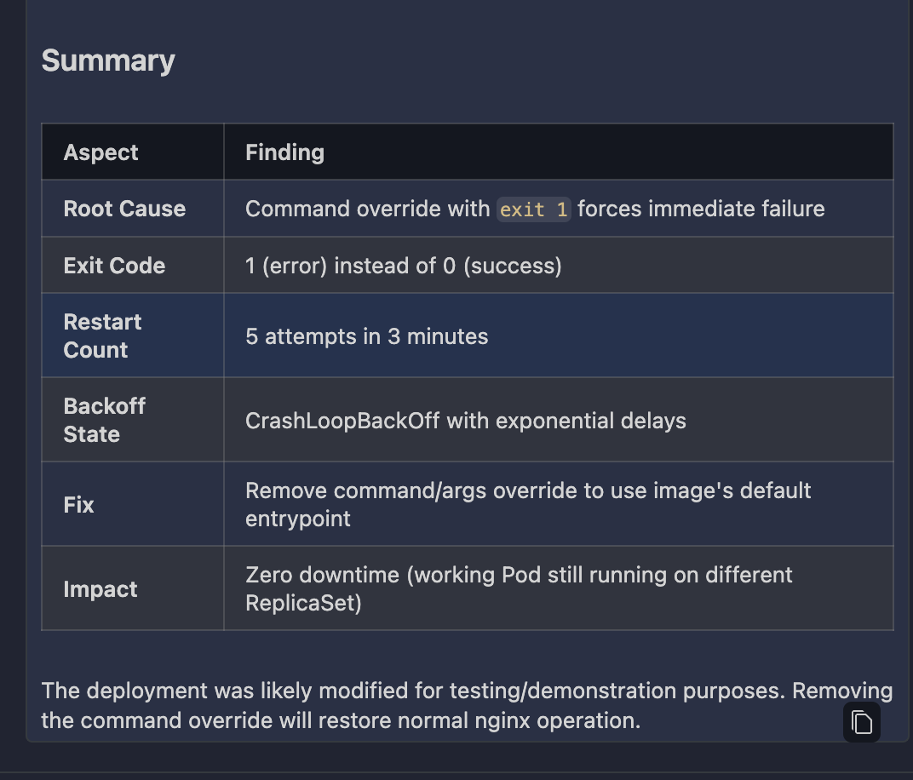

# Learning and Exploring OpenShift with Bob

Welcome to a hands-on exploration of OpenShift operations using IBM Bob's AI-native approach. This learning path guides you through managing cloud-native applications using natural language, building both technical skills and conceptual understanding of container orchestration.

## Table of Contents

1. [Lab Overview](#lab-overview)
2. [Prerequisites](#prerequisites)
3. [Learning Objectives](#learning-objectives)
4. [Getting Started](#getting-started)
   - [Verify Your Environment](#verify-your-environment)
   - [Add Custom OpenShift Modes to Bob](#add-custom-openshift-modes-to-bob)
5. [Part 1: Deploying and Monitoring Application](#part-1-deploying-and-monitoring-applicaiton)
6. [Part 2: Troubleshooting an Application Issue](#part-2-troubleshooting-an-application-issue)
7. [Congratulations!](#congratulations)

---

## Lab Overview

In this lab, you will deploy a simple application and observe **how the system responds behind the scenes**. You will inspect key resources such as **Deployments, ReplicaSets, Pods, Services, and Routes**, and see how they work together to run and expose workloads.

### Prerequisites

- Access to an OpenShift cluster (ROKS, CRC, or any OpenShift 4.x - e.g. a TechZone cluster) and a namespace/project for experimentation
- `oc` CLI installed and authenticated
- IBM Bob installed

### Learning Objectives

By the end of this lab, you will understand:

1. **The Control Loop Architecture** - How OpenShift continuously reconciles desired state with actual state
2. **The Resource Hierarchy** - Why Deployments create ReplicaSets which create Pods, and what each layer provides
3. **Service Discovery & Load Balancing** - How Services provide stable endpoints and Routes expose them externally
4. **The Scheduler's Decision Process** - What factors determine where pods run
5. **Security Boundaries** - How SCCs, RBAC, and namespaces create isolation
6. **Resource Governance** - How quotas and limits prevent resource exhaustion

---

## Getting Started

### Verify Your Environment

Ensure you have connected to your OpenShift cluster:

```bash
oc login <cluster-url> --token=<your-token>
oc whoami
# You should already have a project / namespace
oc project
```

### Add Custom OpenShift Modes to Bob

You'll need two custom modes for this lab.

1. Add the OpenShift DevOps Mode which will be used for Steps 1-11 of the lab exercises.

1. Click the icon in the Bob panel to open Settings

1. Select the `Modes` tab

1. Click the button to `Import` a new mode

1. Add the [`openshift-devops.yaml`](./resources/openshift-devops.yaml) mode from the resources folder

1. Add the Openshift Ops Assistant mode, which is a specialized mode that provides systematic troubleshooting workflows for debugging OpenShift issues.

1. Open Bob Settings → Modes tab

1. Click the button to `Import` a new mode

1. Add the [`openshift-ops-assistant.yaml`](./resources/openshift-ops-assistant.yaml) from the resources folder.

---

## Part 1: Deploying and Monitoring Applicaiton

Before deploying anything, you need to understand the cluster's structure. OpenShift is a distributed system with control plane nodes (managing state) and worker nodes (running workloads). Your operations exist within this topology, and understanding it helps you reason about scheduling, networking, and failure domains.

> **IMPORTANT NOTE:** Many of these commands will return different results based on the RBAC and permissions your user has on the cluster. For the purposes of this lab, you will have a limited user account on the cluster, so some of the commands may fail or return empty results.

1. Switch to the `OpenShift DevOps` mode and prompt Bob with:

   ```text
   Connect to my OpenShift cluster and show me its topology. I want to understand:
   - What nodes exist and their roles
   - What namespaces are available
   - What my current project is
   - What resources already exist in my namespace
   ```

   Bob should execute commands like:
      - `oc whoami` - Verify authentication
      - `oc get nodes` - Show cluster nodes and their roles (control-plane vs worker)
      - `oc get projects` or `oc projects` - List available namespaces
      - `oc project` - Show current namespace
      - `oc describe project <your-namespace>` - Describe the resources in your test namespace

1. Bob will respond back with a comprehensive view of the cluster topology, including node roles, namespaces, current project, and resource inventory Understanding topology is foundational—every operation you perform happens within this distributed system.

1. Lets deploy your first workload and understand the resource hierarchy

   ```text
   Deploy the helloworld application from application-samples/helloworld/deployment.yaml.
   After deploying, explain the resource hierarchy that was created:
   - What is the Deployment?
   - What ReplicaSet was created and why?
   - What Pods exist and what's their relationship to the ReplicaSet?
   - Show me the events that occurred during deployment.
   ```

1. Bob should read [`application-samples/helloworld/deployment.yaml`](application-samples/helloworld/deployment.yaml) and run the appropriate commands to deploy the application.

1. Bob will also validate the deployment using the appropriate commands.
   - `oc get deployment` - The desired state declaration
   - `oc get replicaset` - The controller managing pod replicas
   - `oc get pods` - The actual running containers
   - `oc get events --sort-by='.lastTimestamp'`

1. Bob will confirm the application was deployed.

1. We can continue to use Bob to manage our application using core Openshift concepts. For the purposes of this lab, this is **NOT necessary**, but below are optional steps if you want to explore exposing the application, scaling it, applying security controls, etc.:

   - Expose the Application with a Service (Understanding Service Discovery). Services provide stable endpoints that automatically load-balance across healthy pods. This is fundamental to how microservices communicate in Kubernetes.

      ```text
      Create a Service to expose the helloworld deployment internally on port 8080.
      Then explain:
      - How does the Service find the Pods?
      - What happens if a Pod restarts and gets a new IP?
      - Show me the Service's endpoints and how they map to Pods.
      ```

   - Expose the application via a route. OpenShift Routes (built on HAProxy) provide HTTP/HTTPS ingress with TLS termination, load balancing, and hostname-based routing. Understanding Routes helps you design external access patterns.

      ```text
      Create an OpenShift Route to expose the helloworld service externally.
      Then explain:
      - How does the Route connect to the Service?
      - What is the router doing behind the scenes?
      - Show me the full request path: External User → Route → Service → Pod
      Test the route with curl to verify it's working.
      ```

   - Scale the application manually and understand the reconciliation loop. Understanding the reconciliation loop is key to understanding how Kubernetes works. When you change desired state (replica count), controllers detect the drift and reconcile actual state to match.

      ```text
      Scale the helloworld deployment to 3 replicas.
      While it's scaling, explain what's happening:
      - What controller detects the change?
      - What steps does it take to reconcile?
      - Show me the events and pod creation in real-time.
      - What happens if I delete a pod after scaling?
      ```

   - Create and manage secrets securely. Applications need credentials, API keys, and certificates. Secrets provide a way to inject sensitive data without hardcoding it. But secrets are only base64-encoded by default—understanding their limitations and best practices is critical for production security.

      ```text
      The hello application needs database credentials.
      1. Create a Secret named 'app-database-credentials' with:
         - username: appuser
         - password: SecureP@ssw0rd123
         - database: helloworld_db

      2. Update the deployment to inject these as environment variables:
         - DB_USER from username
         - DB_PASSWORD from password
         - DB_NAME from database

      3. Verify the secret is available in the pod WITHOUT exposing the values in logs

      4. Explain:
         - How are secrets stored in etcd?
         - What are the security limitations?
         - What would you do differently in production?
      ```

   - Understand Pod Scheduling which decides where pods run. It considers resource requests, node capacity, affinity rules, taints/tolerations, and topology constraints. Understanding scheduling helps you design workloads that distribute properly and handle failures gracefully.

      ```text
      Explain how pod scheduling works in OpenShift.

      Use `oc get pods -o wide` only as a reference point. Do not execute commands.

      Focus on:
      - how to interpret pod-to-node mapping
      - how the scheduler makes decisions (resources, distribution, constraints)
      - what patterns reveal scheduling behavior

      Explain what happens and why — not how to run it.
      ```

---

## Part 2: Troubleshooting an Application Issue

Real-world operations involve diagnosing and fixing issues quickly. This troubleshooting section builds confidence in using Bob and OpenShift tools to resolve common problems.

### Scenario

You've deployed the helloworld application, but after making a configuration change, the pod enters CrashLoopBackOff. You need to diagnose and fix the issue using the specialized OpenShift Ops Assistant mode.

1. To get started, lets force an error into our application. There are different ways to do this, we are going to modify the entry point to the container. But you could try different approaches (i.e. change container image, etc.)

   - Modify the deployment to cause a CrashLoopBackOff by adding an invalid command:

      ```bash
      oc edit deployment hello
      ```

      Add these lines under the container spec (after `image:`):

      ```yaml
      command: ["/bin/sh"]
      args: ["-c", "echo 'Starting application...' && exit 1"]
      ```

      The deployment should now look like:

      ```yaml
      spec:
      containers:
      - name: hello
         image: quay.io/redhattraining/hello-world-nginx:v1.0
         command: ["/bin/sh"]
         args: ["-c", "echo 'Starting application...' && exit 1"]
         ports:
         - containerPort: 8080
      ```

      Save and exit. The pod will start crashing immediately.

      >*Note:* Editing YAML files requires attention to spacing.

   - Confirm the pods are failing

      ```bash
      oc get pods
      ```

      You should see:

      ```text
      NAME                     READY   STATUS             RESTARTS   AGE
      hello-xxxxxxxxxx-xxxxx   0/1     CrashLoopBackOff   5          3m
      ```

1. In IBM Bob, Switch to OpenShift Ops Assistant Mode, so we can start debugging. 

1. Prompt Bob:

   ```text
   My hello deployment pod is in CrashLoopBackOff. Please diagnose the issue by:
   1. Checking the pod status and events
   2. Analyzing current logs
   3. Checking previous container logs (critical for crashes)
   4. Identifying the root cause
   5. Suggesting a fix
   ```

1. Bob (in Ops Assistant mode) should go through its workflow:
   - Run an authentication check.
   - Check the pod status and events.
   - Analyze the current logs.
   - Check the previous container logs (critical for crashes).
   - Identify the root cause.
   - Suggest a fix.

1. Bob should provide you an **analysis:**
   - Bob should identify the exit code 1 in the logs
   - Explain that the command is intentionally failing
   - Show the "Starting application..." message followed by immediate exit
   - Recommend removing the command/args override

   

1. [Optional] Based on Bob's diagnosis, feel free to remove the problematic command and get your application running again.

---

## Congratulations!**

🎉🎉 You've completed the OpenShift with Bob lab. You've learned:

- How to deploy and manage applications on OpenShift
- The resource hierarchy and control loop architecture
- Service discovery, routing, and networking
- Security with SCCs and RBAC
- Resource governance with quotas and limits
- Troubleshooting techniques with specialized Bob modes

Keep experimenting, keep learning, and remember: understanding *why* is more valuable than memorizing *how*.

### Additional Resources

- [OpenShift Documentation](https://docs.redhat.com/en/documentation/openshift_container_platform/latest/)
- [OpenShift Overview](https://developers.redhat.com/products/openshift/overview)

---

*Adapted from Client Engineering `bob-intro-labs`. Last Updated: May 2026*
